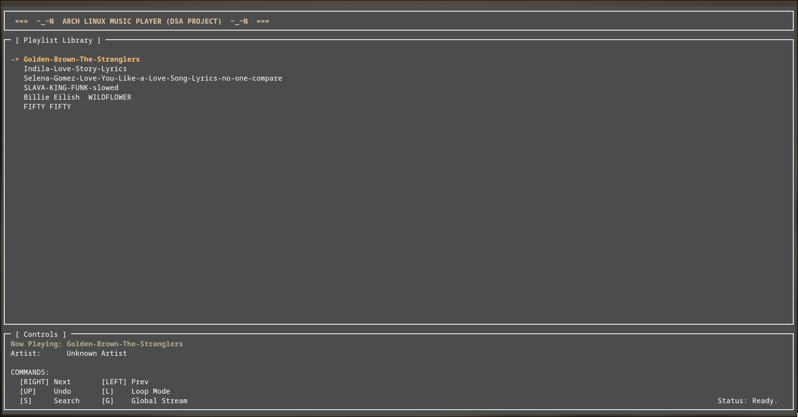
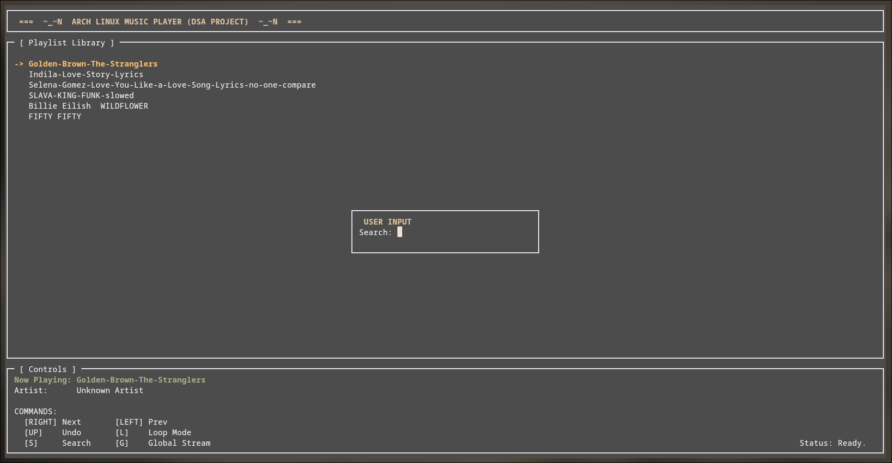

# 🎵 Terminal Music Player (DSA Project)

> A lightweight, feature-rich music player built entirely in C++ to demonstrate practical applications of Data Structures and Algorithms.


## 📊 Project Presentation

View our detailed project presentation: **[DSA Music Player Presentation](./presentation/DSA_Music_Player.pdf)**

The presentation covers:
- Problem statement and motivation
- Data structure design decisions
- Implementation details and challenges
- Complexity analysis
- Demo and results
- Team contributions

---

## 📖 About The Project

This project was developed as a **Data Structures and Algorithms (DSA)** coursework submission for the Computer Science program at **Suez Canal University**. 

The goal was to create a real-world application that implements core DSA concepts from scratch, without relying on high-level libraries or pre-built data structures. This music player features:

- **Custom-built data structures** (Doubly Linked List, Stack)
- **Full Terminal User Interface (TUI)** using ncurses
- **Local file playback** (.mp3, .wav)
- **YouTube streaming integration** (no browser required)
- **Efficient navigation and search algorithms**

Unlike typical music players that use standard library containers, every aspect of queue management, history tracking, and song navigation was implemented manually to showcase DSA principles.

---

## 🧠 Data Structures Implemented

### 1. **Doubly Linked List** (`Playlist.h`)

**Purpose:** Manages the song queue and playback order.

**Why This Structure?**
- Enables **O(1)** traversal to both next and previous songs
- Supports **circular mode** by dynamically linking the tail back to the head
- Allows efficient insertion of new songs at any position

**Key Operations:**
- `addSong()` - Appends a new song to the end of the list
- `playNext()` - Moves forward through the list
- `playPrevious()` - Moves backward through the list
- `toggleLoopMode()` - Converts between linear and circular lists

**Real-World Application:** This is how professional media players maintain their queue structure, allowing seamless forward/backward navigation.

---

### 2. **Stack** (`HistoryStack.h`)

**Purpose:** Tracks user navigation history for "undo" functionality.

**Why This Structure?**
- Implements **Last-In-First-Out (LIFO)** behavior
- Enables users to return to previous songs after jumping via search or skip
- Memory-efficient way to track navigation paths

**Key Operations:**
- `push()` - Saves current song position before jumping
- `pop()` - Returns to the most recent saved position
- `isEmpty()` - Checks if history is available

**Real-World Application:** Similar to the "back" button in web browsers or the undo feature in text editors.

---

## ✨ Features

| Feature | Description | DSA Concept |
|---------|-------------|-------------|
| 🎵 **Local Playback** | Play `.mp3` and `.wav` files from any directory | Linked List Traversal |
| 🌐 **YouTube Streaming** | Stream songs directly from YouTube via `yt-dlp` | Dynamic Node Insertion |
| 🔍 **Fuzzy Search** | Find songs with partial title matching | String Matching Algorithm |
| ⏪ **History Undo** | Navigate back through listening history | Stack (LIFO) |
| 🔁 **Loop Mode** | Toggle between linear and infinite loop playback | Circular Linked List |
| 🖥️ **Full TUI** | Beautiful terminal interface with real-time updates | ncurses Library |

---

## 🛠️ Installation Guide

### Prerequisites

Before installation, ensure your system supports:
- **C++17 or higher**
- **Linux environment** (native Linux or WSL for Windows)
- **Terminal with ncurses support**

---

### Option 1: Linux (Arch / Debian / Ubuntu)

The installer script automatically handles all dependencies (`g++`, `ncurses`, `mpg123`, `mpv`, `yt-dlp`).

#### Steps:

1. **Clone the repository:**
   ```bash
   git clone https://github.com/YOUR_USERNAME/Terminal-Music-Player.git
   cd Terminal-Music-Player
   ```

2. **Run the installer:**
   ```bash
   chmod +x install.sh
   ./install.sh
   ```

3. **Launch the player:**
   ```bash
   ./music_player
   ```

   Or specify a custom music directory:
   ```bash
   ./music_player /home/user/Music
   ```

---

### Option 2: Windows (via WSL)

Since this project uses Linux-specific libraries (`ncurses`), Windows users must use **WSL (Windows Subsystem for Linux)**.

#### Step 0: Install WSL (First-Time Setup)

If you don't have WSL installed:

1. Open **PowerShell** as Administrator
2. Run:
   ```powershell
   wsl --install
   ```
3. **Restart your computer**
4. Open the "Ubuntu" app from your Start Menu and complete the setup

#### Step 1: Install the Music Player

1. Open your WSL terminal (Ubuntu)
2. Navigate to the project folder
3. Run the WSL-specific installer:
   ```bash
   chmod +x install_wsl.sh
   ./install_wsl.sh
   ```

#### Step 2: Access Your Windows Music

WSL accesses Windows files through the `/mnt/c/` path.

**Example:**
- Windows path: `C:\Users\Yousif\Music`
- WSL path: `/mnt/c/Users/Yousif/Music`

Run the player with:
```bash
./music_player "/mnt/c/Users/Yousif/Music"
```

---

## 🎮 Controls & Usage

| Key | Action | Data Structure Operation |
|-----|--------|-------------------------|
| `→` (RIGHT) | Play Next Song | `current = current->next` |
| `←` (LEFT) | Play Previous Song | `current = current->prev` |
| `↑` (UP) | Undo / Go Back | `stack.pop()` |
| `L` | Toggle Loop Mode | Connects `tail->next = head` |
| `S` | Search Library | Linear search with fuzzy matching |
| `G` | Global Stream (YouTube) | Fetches URL & appends new node |
| `Q` | Quit | Proper memory cleanup |

---

## 📁 Project Structure

```
Terminal-Music-Player/
│
├── main.cpp              # Entry point & TUI logic
├── Playlist.h            # Doubly Linked List implementation
├── HistoryStack.h        # Stack implementation
├── Song.h                # Song structure definition
├── FileLoader.h          # Directory scanner & file loader
├── install.sh            # Linux installer script
├── install_wsl.sh        # WSL installer script
└── README.md             # This file
```

---

## 🔬 DSA Concepts Demonstrated

### Time Complexity Analysis

| Operation | Time Complexity | Explanation |
|-----------|----------------|-------------|
| Play Next/Previous | O(1) | Direct pointer access |
| Add Song | O(1) | Append to tail |
| Search Song | O(n) | Linear traversal with fuzzy matching |
| Undo Navigation | O(1) | Stack pop operation |
| Toggle Loop | O(1) | Pointer reassignment |

### Space Complexity

- **Playlist:** O(n) where n = number of songs
- **History Stack:** O(m) where m = number of jumps made
- **Overall:** O(n + m)

---

## 🚀 Future Enhancements

Potential improvements for this project:

- [ ] Implement a **Binary Search Tree** for faster song lookups
- [ ] Add **shuffle mode** using a randomization algorithm
- [ ] Create **playlists** using multiple linked lists
- [ ] Implement **A-Z sorting** using Merge Sort or Quick Sort
- [ ] Add **queue system** for upcoming songs
- [ ] Implement **graph-based recommendations** based on listening history

---

## 🎓 Academic Context

**Course:** Data Structures and Algorithms  
**Institution:** Suez Canal University  
**Program:** Computer Science  
**Academic Year:** 2025/2026

This project demonstrates:
- ✅ Custom implementation of fundamental data structures
- ✅ Practical application of algorithms (search, traversal)
- ✅ Memory management in C++
- ✅ Time and space complexity optimization
- ✅ Real-world software development practices

---

## 🤝 Contributing

This is an academic project, but suggestions and improvements are welcome!

1. Fork the repository
2. Create a feature branch (`git checkout -b feature/improvement`)
3. Commit your changes (`git commit -m 'Add new feature'`)
4. Push to the branch (`git push origin feature/improvement`)
5. Open a Pull Request

---

## 📝 License

This project is developed for educational purposes as part of university coursework.

---

## 👥 Team Members

This project was developed collaboratively by a team of 7 Computer Science students:

| Name | GitHub | Contribution |
|------|--------|--------------|
| **Yousif Elkattawy** | [@Yousif-elkot](https://github.com/Yousif-elkot) | Team Lead, TUI Design, File System, Audio Integration, Main Logic |
| **Yousif Hal** | *TBD* | `playNext()` Function Implementation |
| **Yehya Hal** | *TBD* | `playPrevious()` Function Implementation |
| **Yousif Omar Elhamahmy** | *TBD* | `addSong()` Function & Linked List Operations |
| **Yousif Khaled** | [@Khaldoze](https://github.com/khaldoze)  | `searchSong()` Algorithm & Project Presentation |
| **Yousif Elshehawy** | *TBD* | Complete History Stack Implementation (`push`, `pop`, `peek`) |
| **Yousif Emira** | *TBD* | `toggleLoopMode()` & Circular List Logic |

**Institution:** Suez Canal University, Port Said, Egypt  
**Course:** Data Structures and Algorithms  
**Academic Year:** 2024/2025

> *GitHub links will be updated soon*

---

## 🙏 Acknowledgments

- **Suez Canal University** - For providing the academic framework
- **Dr.Fatma Elsayed** - For guidance and project requirements
- **ncurses Library** - For terminal UI capabilities
- **yt-dlp & mpv** - For enabling YouTube streaming functionality

---

## 📸 Screenshots

### Main Interface

*Terminal UI showing the playlist and currently playing song*

### Search Feature

*Fuzzy search in action*

---

## 🐛 Known Issues

- YouTube streaming requires stable internet connection
- Some terminal emulators may not support full ncurses colors
- Large music libraries (1000+ songs) may cause slow initial loading

---

## ❓ FAQ

**Q: Why C++ and not Python?**  
A: This project emphasizes low-level memory management and manual data structure implementation, which are better demonstrated in C++.

**Q: Can I use this with Spotify or other streaming services?**  
A: Currently, only local files and YouTube are supported. Streaming services require API authentication.

**Q: Does this work on macOS?**  
A: Yes, with minor modifications to the install script for Homebrew package management.

---

**⭐ If you found this project helpful, please consider giving it a star!**
